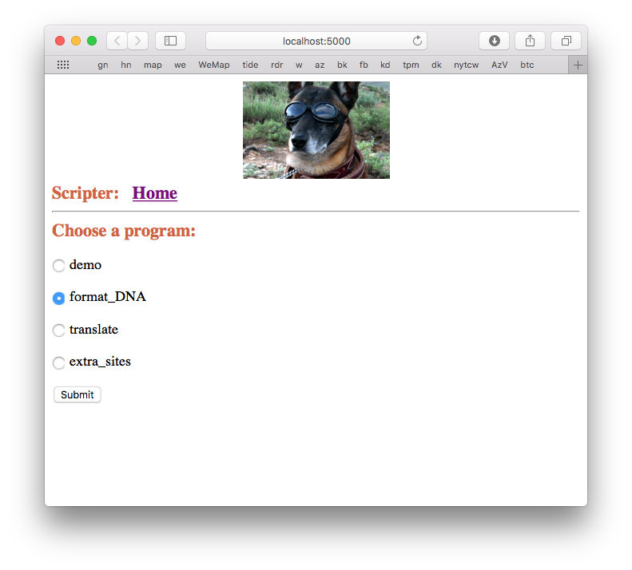

This project is a demo of the micro-framework Flask.  It's definitely a work in progress and some things seem to be broken (four years later).  

However, if you have Flask installed

```
pip install flask
```

Then start the script:

```
> python run.py
 * Running on http://127.0.0.1:5000/ (Press CTRL+C to quit)
 * Restarting with stat
 * Debugger is active!
 * Debugger PIN: 181-062-869
127.0.0.1 - - [17/Jan/2018 06:39:38] "GET / HTTP/1.1" 200 -
...
```

and just point your browser at ``localhost``



Most of the logic is in [views.py](app/views.py).  A sample DNA sequence is [here](app/static/SThemA.txt).
